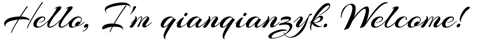

 

Hello, I'm qianqianzyk. 
Welcome!

**About me**

I'm a student from China. 
I love coding! 
And welcome to my [blog](https://blog.qianqianzyk.top/)

**My Github Contributions**

<picture>
  <source media="(prefers-color-scheme: dark)" srcset="https://raw.githubusercontent.com/qianqianzyk/qianqianzyk/output/github-contribution-grid-snake-dark.svg">
  <source media="(prefers-color-scheme: light)" srcset="https://raw.githubusercontent.com/qianqianzyk/qianqianzyk/output/github-contribution-grid-snake.svg">
  
</picture>
